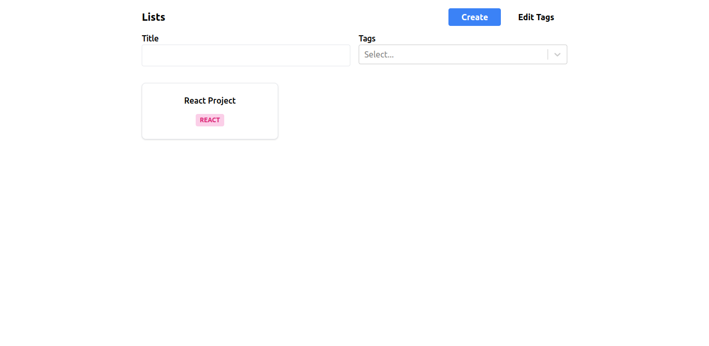

# Markdown-React

<h2 align="center">
  
</h2>

For see more about the project, please click in the [link](https://github.com/Filipe-Santos17/markdown-react/blob/main/public/videos/video-example.mp4)

## :four_leaf_clover: Technologies used

This project is being developed with the following technologies.

-   [ReactJS](https://reactjs.org/)
-   [TypeScript](https://www.typescriptlang.org/docs/)
-   [Tailwindcss](https://tailwindcss.com/)
-   [React-Router-Dom](https://reactrouter.com/en/main)
-   [React-Markdown](https://github.com/remarkjs/react-markdown)
-   [React-Select](https://react-select.com/home)
-   [VS Code](https://code.visualstudio.com/)


## :rocket: Run the code

To clone and upload the application, you need [Git](https://git-scm.com) and [Node.js](https://nodejs.org/en) installed on your machine.

```bash
# Make a clone of the application.
$ git clone https://github.com/Filipe-Santos17/markdown-react

# Open the folder.
$ cd markdown-react

# Install the dependencies.
$ npm install

# Run the code.
$ npm run dev

```

[Filipe Santos on Linkedin](https://www.linkedin.com/in/filipemarquesdeveloper/)
